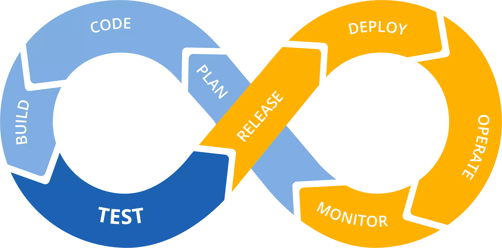

# KodrOps


&nbsp;

> 
> Also watch [the YouTube videos](https://www.youtube.com/playlist?list=PLhIpOmnABuWn2u54ldK6sf5AB2GRbyNSl) (currently only available in Spanish)

&nbsp;

## Overview

This project is meant to serve as an example of a complete(ish) DevOps cycle implementation.

Taking a simple web app as a starting point, the aim of the project is to provide:

- A development environment that aims to resemble the production environment as closely as possible and, at the same time, is easy to use for the development team.
- Automated pipelines for:
  - Provisioning, testing and maintaining the production infrastructure
  - Building, testing application code and releasing/deploying it in production
- Monitoring the application

 _The DevOps cycle_

Needless to say, the purpose of this implementation is to showcase _one_ way of putting the pieces of the DevOps puzzle together. In no way does it pretent do be a one-size-fits-all, silver bullet solution or even be production-ready. It can be, in any case, a good starting point for your own implementations.

The MERN application used in the project is taken from https://github.com/samaronybarros/movies-app, modified where needed to add testing and integration with a CI/CD pipeline.


_The MERN app in all its glory_

A separate application called Hello is also included. This is just a simple "hello, world"-style app that comes in handy for troubleshooting.


_Cute kitty picture by [placekitten](https://placekitten.com)_

## Development environment

Development requires [Skaffold](https://skaffold.dev/) and a running Kubernetes cluster.

The development environment used to write this project consisted of:

- Ubuntu 20.04.1 LTS running on Windows Subsystem for Linux v2
- Docker-Desktop v19.03.12
- Kubernetes v1.16.6
- Make
- Skaffold v1.13.1
- Terraform v0.13.1

Start a development environment by running

```
$ make dev
```

at the root directory of the project. This makes sure that skaffold is running on the correct K8s context. This context can be specified in the environment variable `SKAFFOLD_CONTEXT`. It defaults to "docker-desktop".


_Skaffold in action_

## Production

The application will be deployed to a Kubernetes cluster running on the Google Kubernetes Engine. The cluster can be either zonal (currently limited to a single zone) or regional, depending on whether a zone name or a region name are specified as the location for the cluster.

DNS is provided by DNSimple. Once the ingress-nginx load-balancer is created in Kubernetes, DNS records pointing to its public IP address are created using the DNSimple provider for Terraform. In a real-world scenario it would be simpler and safer to just use Google Domains and a GCP DNS zone, and/or reserve a fixed IP address to use with the project. For this exercise we decided to keep costs to the bare minimum, so we registered an .xyz domain with [Namecheap](https://www.namecheap.com) for \$1 and then used a 30-day free trial in [DNSimple](https://dnsimple.com) (Namecheap does provide its own API for automation, but it requires a \$50 deposit or 20 registered domains). Although contrived, this setup also provided an extra challenge.

The images for the container are stored publicly in Docker Hub. In a real-world scenario, it would probably be advisable to use GCP's container registry instead.


### Preliminaries

- Log on to the GCP console or use the gcloud CLI with suitable credentials. Please refer to the [gcloud documentation](https://cloud.google.com/sdk/gcloud) for more information on how to to this.
- Create a new project. Take note of its id since it may be different from the name you chose.
- Create a service account to allow Terraform and the CI/CD pipeline to access the GCP project. Assign `Project/Owner` and `Cloud storage/Storage Admin` roles.
- Export the service account key in JSON format.

### Terraform and GCP authentication in your local machine:

- Create a text file called `account.json` (or some other name) and paste the service account credentials into it.
- Create an environment variable named `GOOGLE_APPLICATION_CREDENTIALS` (this name _does_ matter) and give it the value `account.json`
- Copy `account.json` to both the `infra/gcp-bootstrap` and `infra/gcp` directories.
- **IMPORTANT: Make sure to include `account.json` in .gitignore**

### Terraform and DNSimple authentication in your local machine:

- At the [DNSimple](https://dnsimple.com) website, go to `User Settings`
- Take note of the account id by looking at the URL
- Create a new Access Token
- Create the following environment variables:
  - TF_VAR_dnsimple_account=&lt; your account id >
  - TF_VAR_dnsimple_token=&lt; the access token >

### Bootstrapping the infrastructure

A small bootstrapping operation is required before the automated pipeline can be run:

- In your local machine, go to &lt:project-dir>/infra/gcp-bootstrap
- Run

```
$ terraform init
$ terraform plan
$ terraform apply
```

This will create a bucket for Terraform to store the infrastructure state and will also enable the necessary GCP APIs.

### CI/CD pipeline

The CI/CD pipeline uses Github Actions to automate infrastructure provisioning, application testing, Docker image builds and deployment of Kubernetes manifests.

The pipeline requires the following secrets to be defined:

- **DOCKER_PASSWORD:** the password for the Docker Hub account
- **DOCKER_USERNAME:** the username for the Docker Hub account
- **GCP_CLUSTER_NAME:** the name that will be given to the cluster
- **GCP_PROJECT_ID:** the id for the GCP project (which may differ from the project's name)
- **GCP_SA_KEY:** key for the service account used to access GCP, in JSON format
- **GCP_SA_KEY_TERRAFORM:** key for the service account used by Terraform to access GCP, in JSON format
- **GCP_LOCATION_TYPE:** value should be either `region` or `zone` depending on whether we want to create a regional or zonal cluster
- **GCP_LOCATION:** the GCP region/zone we will be targeting. Must be consistent with GCP_LOCATION_TYPE
- **TF_VAR_DNSIMPLE_ACCOUNT:** the DNSimple account id (see above)
- **TF_VAR_DNSIMPLE_TOKEN:** the DNSimple access token (see above)

Notice that TF_VAR_DNSIMPLE_ACCOUNT and TF_VAR_DNSIMPLE_TOKEN are in all-caps, as GitHub seems to enforce this for secret names. Terraform requires env vars to be in the format TF_VAR_variable-name-in-lowercase. This is taken care of in the workflows.

Both test and deployment workflows are included.

Test workflows are run when creating/updating a pull request that contains changes in the source code.


_The client app passes its tests_


_No such luck with the backend_

Deployment workflows are run when the master git branch changes, either by directly pushing commits to it (not recommended) or by merging a pull request.

- The deploy-gcp workflow is in charge of setting up and updating the whole infrastructure. After running Terraform, it deploys the necessary Kubernetes manifests. It is triggered when changes are made inside the infra/gcp directory
- The deploy-manifests workflow keeps the Kubernetes side of things updated. It is triggered when changes are made inside any of the infra/k8s-\* directories (with the exception of infra/k8s-dev)
  Since both workflows deploy the same manifests to the cluster, and Github Actions currently doesn't support invoking a workflow from another, part of this common code has been moved to the `test-prod-manifests` and `deploy-prod-manifests` targets in the makefile in order to make things (somewhat) DRYer.


_Deploying the infrastructure via Terraform..._


_... and then deploying the Kubernetes manifests_


_Building a Docker image for the client app and deploying it to the production cluster_

### Monitoring

A monitoring stack based on Prometheus and Grafana is deployed alongside the MERN application, in a separate Kubernetes namespace. It includes a simple dashboard that reads some custom metrics generated by the backend application.


_Some of the custom metrics exposed by the express backend_


_The dashboard in Grafana_

The Prometheus front-end is exposed at `https://prom.your-domain-name`, the Grafana front-end is exposed at `https://graf.your-domain-name`. While this convenient for demo purposes, in a real life situation it probably wouldn't be desirable to do this, and it would be more sensible to access them by using a Kubernetes port forward command such as:

```
kubectl port-forward service/kodrops-xyz-grafana 3000:80 -n monit
```

Currently no persistent storage is used, so all metrics are reset every time the Prometheus/Grafana pods are recreated. This also resets the Grafana password.

To obtain the current password for Grafana, make sure you are connected to the correct K8s context and execute

```

kubectl get secret --namespace monit kodrops-xyz-grafana -o jsonpath="{.data.admin-password}" | base64 --decode ; echo

```

If you chose a name other than `kodrops-xyz` for the cluster, you'll need to replace it in the command above.

Launching a locust stress test is a good way to see the Grafana dasboard in action.

### Running stress tests

A simple stress testing script using [Locust](https://locust.io/) is included in the locustfile.py file in the root directory of the project. It runs on a Docker container, so it is not necessary to install python, pip or locust itself on the dev machine. The script can be started by running

```
$ make stress
```

&nbsp;

> ## To Do / Possible improvements
>
> - Streamline dev/prod k8s manifests (kustomize? Helm?) to keep things DRY
> - Use a Kubernetes statefulSet to provide persistence to MongoDb
> - Ditto for Prometheus and Grafana
> - Add healthchecks to all deployments/services
> - Add Elastic Stack as a logging solution
> - Use a VPC-Native cluster instead of a routes-based one
> - Add infrastructure tests (Inspec? Terratest?)
> - Automated build and use of tagged, version-pinned images instead of `latest` in production
> - Add autoscaling
> - Explore other Kubernetes resource types, such as CronJobs and DaemonSets
> - Fully-fledged GitOps with ArgoCD? Flux? Jenkins X? Tekton?

> ## Contributing

This project was put together for learning purposes. Please feel free to fork it. Pull requests with corrections or additions are most welcome.

&nbsp;

> ## Sources of knowledge and inspiration
>
> - [The DevOps online bootcamp by GeeksHubs](https://bootcamp.geekshubsacademy.com/online/devops/)
> - Brett Fisher's [Docker Mastery](https://www.udemy.com/course/docker-mastery/) and [Docker for Node.js](https://www.udemy.com/course/docker-mastery-for-nodejs/) courses at Udemy
> - Stephen Grider's [Microservices with Node JS and React](https://www.udemy.com/course/microservices-with-node-js-and-react/) course, also at Udemy
> - The official documentation for [Docker](https://docs.docker.com/), [Kubernetes](https://kubernetes.io/docs/home/), [Terraform](https://www.terraform.io/docs/index.html) and more
> - Plus the obligatory bajillion Google searches and YouTube videos
